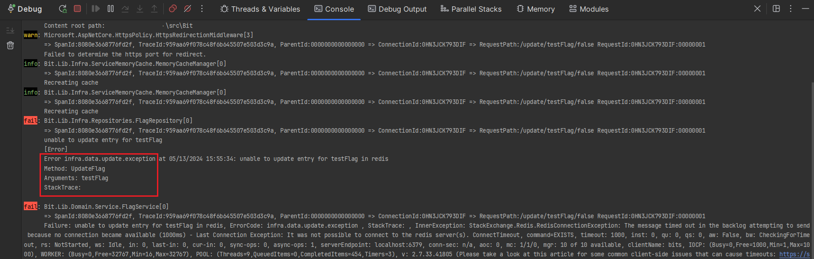
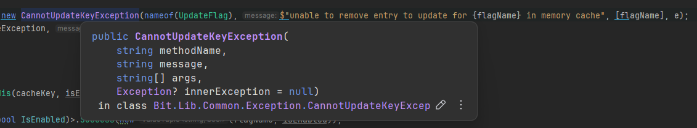

# Logging

It's important to get right.

## Why?
It's a cross-cutting concern that has impact on your application stability, performance, and maintainability.

## What?
Open Telemetry is a vendor-neutral standard for distributed tracing. 

It's a project of the [Cloud Native Computing Foundation](https://www.cncf.io/).

## Tech Stack
- dotnet 8
- Open Telemetry
- Serilog
- Microsoft.Extensions.Logging

## LOGS 101

### The Logger
* Log structured
* Log clean
* Log consistent
* Log with context
* Log with correlation
* Log with performance
* Log with privacy
* Log with compliance

### How to set up your structured logging for consistency?
* Use 1 logging framework
* Use Constants
* Use unified exceptions
* Follow the basics


```csharp
using Microsoft.Extensions.Logging;

public class Logging101
{
    private readonly ILogger<Logging101> _logger; // Define the category with <Logging101>

    public Logging101(ILogger<Logging101> logger)
    {
        _logger = logger;
    }

    public void DoSomething()
    {
        _logger.Debug("Doing something"); // Log level: Debug by default. Logging is expensive.
    }
}

```
#### How do I choose the log level?
Use microsoft's log level guidelines. 
It works for most cases. Personally if data is missing I like to `_logger.Error()` it.   
```csharp
// Decompiled with JetBrains decompiler
// Type: Microsoft.Extensions.Logging.LogLevel
// Assembly: Microsoft.Extensions.Logging.Abstractions, Version=8.0.0.0, Culture=neutral, PublicKeyToken=adb9793829ddae60
// MVID: FC2DE29B-920B-4475-950C-0ADF08F18D99
// Assembly location: ..\.nuget\packages\microsoft.extensions.logging.abstractions\8.0.0\lib\net8.0\Microsoft.Extensions.Logging.Abstractions.dll
// XML documentation location: ..\.nuget\packages\microsoft.extensions.logging.abstractions\8.0.0\lib\net8.0\Microsoft.Extensions.Logging.Abstractions.xml

#nullable disable
namespace Microsoft.Extensions.Logging
{
  /// <summary>Defines logging severity levels.</summary>
  public enum LogLevel
  {
    /// <summary>
    /// Logs that contain the most detailed messages. These messages may contain sensitive application data.
    /// These messages are disabled by default and should never be enabled in a production environment.
    /// </summary>
    Trace,
    /// <summary>
    /// Logs that are used for interactive investigation during development.  These logs should primarily contain
    /// information useful for debugging and have no long-term value.
    /// </summary>
    Debug,
    /// <summary>
    /// Logs that track the general flow of the application. These logs should have long-term value.
    /// </summary>
    Information,
    /// <summary>
    /// Logs that highlight an abnormal or unexpected event in the application flow, but do not otherwise cause the
    /// application execution to stop.
    /// </summary>
    Warning,
    /// <summary>
    /// Logs that highlight when the current flow of execution is stopped due to a failure. These should indicate a
    /// failure in the current activity, not an application-wide failure.
    /// </summary>
    Error,
    /// <summary>
    /// Logs that describe an unrecoverable application or system crash, or a catastrophic failure that requires
    /// immediate attention.
    /// </summary>
    Critical,
    /// <summary>
    /// Not used for writing log messages. Specifies that a logging category should not write any messages.
    /// </summary>
    None,
  }
}

```

#### Exception Handling
Having a structured exception handling is important. It helps you to understand what went wrong, where it went wrong, and why it went wrong.
 
However, it's a pain to do it.
* The initial setup sucks.
* The maintenance sucks.

Why do it then?



You'll know which exception, where it happened, and why it happened. Making debugging easier.

__How to do it?__

Define your topics in a constants class. Just generic or custom topics you wish to log about.

```csharp
public static class TopicDictionary
{
    public const string Infra = "infra";
    public const string Data = "data";
    public const string Connection = "connection";
    public const string Error = "error";
    public const string Create = "create";
    public const string Missing = "missing";
    public const string Critical = "critical";
    public const string Cache = "redis";
    public const string Delete = "delete";
    public const string Information = "information";
    public const string Update = "update";
    public const string Flush = "flush";
    public const string Feature = "feature";
    public const string Flag = "flag";
    public const string Statistics = "statistics";
    public const string MemoryCache = "memory-cache";
    public const string RedisCache = "redis-cache";
    public const string FlagIsEnabled = "is-enabled";
    public const string FlagIsDisabled = "is-disabled";
    public const string ConnectionString = "connection-string";
    public const string Credential = "credential";
    public const string KeyCount = "key-count";
    public const string ApiKey = "api-key";
    public const string Unauthorized = "unauthorized";
    public const string Security = "secutiry";
}
```
Define the errors, and group them by layer.

```csharp
public static class ExceptionCodes
{
    private const string ExceptionPrefix = "exception";
    private const string CriticalError = "critical.error";

    public static class Infrastructure
    {
        public const string ApiKeyNotFound = $"{TopicDictionary.Infra}.{TopicDictionary.Credential}.{TopicDictionary.Missing}.{ExceptionPrefix}.{TopicDictionary.Critical}.{TopicDictionary.ApiKey}";
        public const string RedisConnectionStringEmpty = $"{TopicDictionary.Infra}.{TopicDictionary.Connection}.{TopicDictionary.ConnectionString}.{TopicDictionary.Missing}.{CriticalError}.{TopicDictionary.Cache}";
        public const string CannotFlushCache = $"{TopicDictionary.Infra}.{TopicDictionary.Cache}.{TopicDictionary.Flush}.{ExceptionPrefix}.{TopicDictionary.Data}.{TopicDictionary.Error}";
        public const string CannotGetMemoryCacheStatistics = $"{TopicDictionary.Infra}.{TopicDictionary.Cache}.{TopicDictionary.MemoryCache}.{TopicDictionary.Statistics}.{ExceptionPrefix}";
        public const string CannotGetRedisCacheStatistics = $"{TopicDictionary.Infra}.{TopicDictionary.Cache}.{TopicDictionary.RedisCache}.{TopicDictionary.Statistics}.{ExceptionPrefix}";
        public const string Unauthorized = $"{TopicDictionary.Infra}.{TopicDictionary.Security}.{TopicDictionary.Unauthorized}.{ExceptionPrefix}";
    }

    public static class Data
    {
        public const string CannotCreateFlag = $"{TopicDictionary.Infra}.{TopicDictionary.Data}.{TopicDictionary.Create}.{ExceptionPrefix}";
        public const string CannotDeleteFlag = $"{TopicDictionary.Infra}.{TopicDictionary.Data}.{TopicDictionary.Delete}.{ExceptionPrefix}";
        public const string CannotFindKey = $"{TopicDictionary.Infra}.{TopicDictionary.Data}.{TopicDictionary.Information}.{TopicDictionary.Missing}";
        public const string CannotUpdateKey = $"{TopicDictionary.Infra}.{TopicDictionary.Data}.{TopicDictionary.Update}.{ExceptionPrefix}";
        public const string FeatureDisabled = $"{TopicDictionary.Infra}.{TopicDictionary.Feature}.{TopicDictionary.FlagIsDisabled}.{ExceptionPrefix}";
        public const string KeyNotFound = $"{TopicDictionary.Infra}.{TopicDictionary.Data}.{TopicDictionary.Missing}.{ExceptionPrefix}";
    }
}
```

Define your Base Exception, here you can all the common properties you want to log.
```csharp
using Bit.Lib.Common.Exception;

namespace Bit.Lib.Common.Base;

public abstract class BaseException(string errorCode, string message, string methodName, Severity severity, string[] args, System.Exception? innerException = null)
    : System.Exception(message, innerException)
{
    public string ErrorCode { get; } = errorCode;
    public DateTime ErrorTime { get; } = DateTime.UtcNow;
    public string MethodName { get; } = methodName;
    public string[] Arguments { get; } = args;
    public Severity Severity { get; } = severity;

    public override string ToString()
    {
        var stringBuilder = new System.Text.StringBuilder();
        stringBuilder.Clear();
        stringBuilder.AppendLine($"[{Severity.ToString()}]");
        stringBuilder.AppendLine($"Error {ErrorCode} at {ErrorTime}: {Message}");
        stringBuilder.AppendLine($"Method: {MethodName}");

        if (Arguments.Length > 0)
        {
            stringBuilder.AppendLine($"Arguments: {string.Join(", ", Arguments)}");
        }
        else
        {
            stringBuilder.AppendLine("Arguments: No arguments");
        }

        stringBuilder.AppendLine($"StackTrace: {StackTrace}");

        return stringBuilder.ToString();
    }
}
```

You can also group your exceptions by a layer, or topic clusters for example: `DataExceptions`, `InfraExceptions`, `SecurityExceptions`, etc.

```csharp
namespace Bit.Lib.Common;

public abstract class InfrastructureException(string errorCode, string message, string methodName, Severity severity, string[] args, System.Exception? innerException = null)
    : BaseException(errorCode, message, methodName, severity, args, innerException);
```
And finally your topic exception.
```csharp
namespace Bit.Lib.Common.Exception;
public class CannotUpdateKeyException(string methodName, string message, string[] args, System.Exception? innerException = null) : InfrastructureException(ExceptionCodes.Data.CannotUpdateKey, message, methodName, Severity.Error, args, innerException);
```
Notice the coded exception? `ExceptionCodes.Data.CannotUpdateKey = "infra.data.update.exception"`. 



Providing you with a structured exception, that you can log, and easily understand what went wrong.


## The Configuration

In the appsettings.json file, you can configure the logging providers.

```json
{
  "Logging": {
    "LogLevel": {
      "Default": "Information",
      "Microsoft.AspNetCore": "Warning",
      "Microsoft.Hosting.Lifetime": "Information",
      "System": "Warning",
      "Microsoft": "Warning"
    },
    "Console": {
      "IncludeScopes": true,
      "FormatterName": "json",
      "FormatterOptions": {
        "IncludeScopes": true,
        "TimestampFormat": "yyyy-MM-ddTHH:mm:ss.fffZ",
        "UseUtcTimestamp": true,
        "JsonWriterOptions": {
          "Indented": false
        }
      }
    },
    "OpenTelemetry": {
      "Traces": {
        "Sampler": "ParentBased(AlwaysOn)",
        "Exporter": "otlp",
        "OtlpExporterOptions": {
          "Endpoint": "http://localhost:4317",
          "Protocol": "http/protobuf"
        }
      }
    }
  },
  "Histograms": [
    {
      "Name": "http_request_duration",
      "Unit": "milliseconds",
      "Description": "Distribution of HTTP request durations"
    },
    {
      "Name": "http_response_size",
      "Unit": "bytes",
      "Description": "Distribution of HTTP response sizes"
    },
    {
      "Name": "db_query_duration",
      "Unit": "milliseconds",
      "Description": "Distribution of database query durations"
    },
    {
      "Name": "cache_hit_latency",
      "Unit": "milliseconds",
      "Description": "Distribution of cache hit latencies"
    },
    {
      "Name": "queue_processing_time",
      "Unit": "milliseconds",
      "Description": "Distribution of queue processing times"
    },
    {
      "Name": "memory_allocation",
      "Unit": "bytes",
      "Description": "Distribution of memory allocations"
    }
  ],
  "ConnectionStrings": {
    "Redis": "localhost:6379,abortConnect\u003dfalse,ssl\u003dfalse,allowAdmin\u003dtrue,defaultDatabase\u003d0,connectTimeout\u003d1000,responseTimeout\u003d1000,syncTimeout\u003d1000,connectRetry\u003d3,name\u003dbits"
  },
  "AllowedHosts": "*",
  "ApiKey": "xxxxx"
}


```
